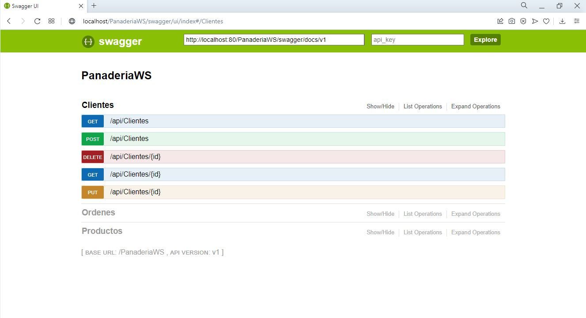
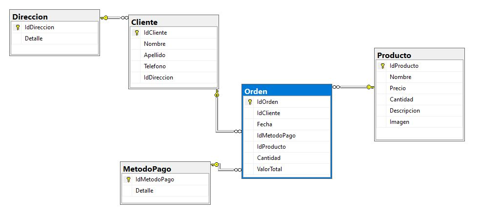

# Panadería BACKEND
Como posible solución al escenario planteado, se desarrollo web services que trabajan con 3 tablas principales (Cliente,Producto,Orden). Se Utilizo con: 
+ <b>Framework:</b> .Net 
+ <b>Base de Datos:</b> SQL SERVER 

<b>Arquitectura </b> 
La solución Panaderia contiene 2 proyectos: 
+ Capa lógica -> Panaderia.BL  
 Data: Context para accesoo a datos 
 DTOS: Clases para el mapeo 
 Model: Clases de la BD a nivel BL 
 Repositorio 
 Servicios 
+ Capa de Servicios -> PanaderiaWS 
Contorollers: Servicios REST 

Acceso a datos -> Entity Framework 
Para realizar pruebas de cada servicio de utilizó <b>POSTMAN</b>
 

<b>Publicacion Local</b>

 
Para su posterior uso los servicios web se alojaron localmente en IIS, para su ejecución es necesario habilitar el mismo mediante el panel de control. Una vez habilitado en un navegador color la siguiente URL:
http://localhost/PanaderiaWS/.
 
Ademas se uso <b> SWAGGER </b> para un mejor manejo de los servicios sin necesidad de utilizar un tercero como POSTMAN. Para ejecutar Swagger en el servidor local usar la siguiente URL: http://localhost/PanaderiaWS/swagger
 

<b>Base de datos</b>
 
Se adjunta backup.
